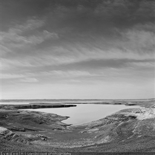
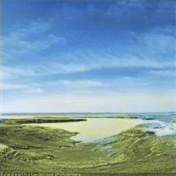
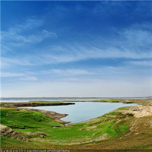
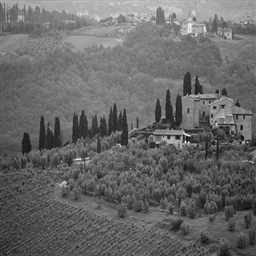
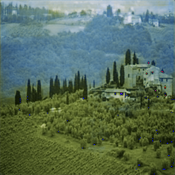
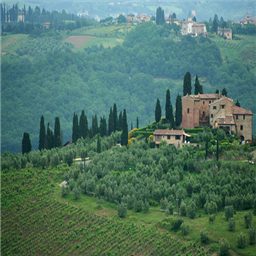
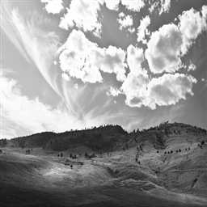
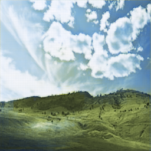
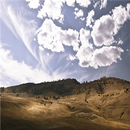

# Colorization
A simple colorization neural network.

# Feature
+ Using `Chainer`
+ Using CNN(Convolutional Neural Network)
+ Using 8 convolution layers, and 8 deconvolution layers
+ No pooling layers
+ No fully connected layers

# Example
| Grayscale Image | Output Image | Original Image |
| -------------- | --------------- | ------------ |
||||
||||
||||

# Instrations
3 steps to install easily.

1. Install `python3.5`
2. Install `chainer`.
3. Clone this repo.

```
$ git clone https://github.com/NotFounds/Colorization.git
$ cd Colorization
```

# Usage
## File Hierarchy
Prepare some grayscale images and corresponging color images.  
And resize imeges to 256 * 256.
```
Colorization ---- train_256_gray ---- (grayscale images)
                  train_256      ---- (color images)
                  test_256_gray  ---- (grayscale images)
                  model.py
                  train.py
                  test.py
                  util.py
```

## Train
You may have to change some following paramaters in `train.py`.
+ dataset directory path
+ epoch num
+ batch size
+ etc..

```
$ python train.py
``` 

## Test
You may have to change some following paramaters in `test.py`.
+ dataset directory path  
+ trained model/optimizer file path
+ etc..

```
$ python test.py
```

# License
MIT License