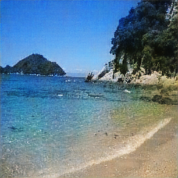

# Colorization
A simple colorization neural network.

# Feature
+ Using `Chainer`
+ Using 8 convolution layers, and 8 deconvolution layers
+ No pooling layers
+ Able to classify a image
+ Supporting `GPU`

# Neural Network Model


# Example

```
$ python test.py --model_class ./examples/class.model --model_color ./examples/color.model --dataset ./examples/gray --mapsize 8
```

|Grayscale image|Output image|Classification|
|---------------|------------|--------------|
|||88.7656%: Beach|
|||99.4129%: Sunset|
|||59.5202%: Glassland|

# Instrations
3 steps to install easily.

1. Install [Python3.5](https://www.python.org/).
3. Install [Cupy](https://cupy.chainer.org/).
3. Install [Chainer](https://chainer.org/).
4. Clone this [repo](https://github.com/NotFounds/Colorization).

```
$ git clone https://github.com/NotFounds/Colorization.git
$ cd Colorization
```

# Usage
## File Hierarchy
Prepare some grayscale images and corresponging color images.  
And resize imeges to 256 * 256.  
A 10% images of `train` folder is used as evaluation data.
```
Colorization ---- train ---- (color images) -- label1
              |                             +- label2
              |                             +-    :
              |                             +- labeln
              +-- test ----- (gray images)
              +-- model.py
              +-- train.py
              +-- test.py
              +-- util.py
```

## Train
You may have to change some following paramaters in `train.py`.
```
$ python train.py [options]
```
| option            | type  | description                                            |
| ----------------- | ----- | ------------------------------------------------------ |
| --batchsize, -b   | int   | batch size. default is 50.                             |
| --epoch_class     | int   | epoch num. default is 300.                             |
| --epoch_color     | int   | epoch num. default is 400.                             |
| --dataset, -d     | path  | the directory path of train data. default is `./train`.|
| --out, -o         | path  | the directory path of output. default is `./output`.   |
| --gpu, -g         | int   | gpu id. default is -1.(no gpu)                         |
| --snapshot        | None  | take snapshot of the trainer/model/optimizer.          |
| --no_out_image    | None  | don't output images.                                   |
| --no_print_log    | None  | don't print log.                                       |
| --del_grad        | None  | don't learn convolution layer in colorization model. use the weight trained by classification model. |

## Test
You may have to change some following paramaters in `test.py`.
```
$ python test.py [options]
```
| option            | type  | description                                                      |
| ----------------- | ----- | ---------------------------------------------------------------- |
| --dataset, -d     | path  | the directory path of input data. default is `./test`. if given a file path, colorize the image. |
| --out, -o         | path  | the directory path of output. default is `./output`.             |
| --model_class     | path  | the file path of learned NN model. default is `./class.model`.   |
| --model_color     | path  | the file path of learned NN model. default is `./color.model`.   |
| --gpu, -g         | int   | gpu id. default is -1.(no gpu)                                   |

# License
MIT License